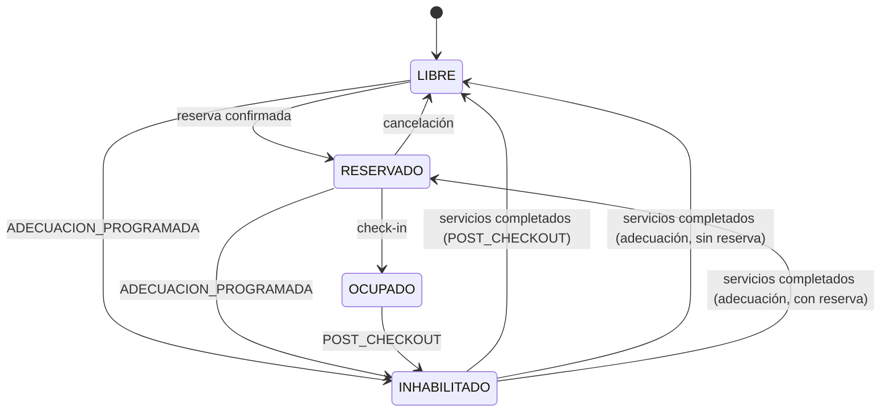
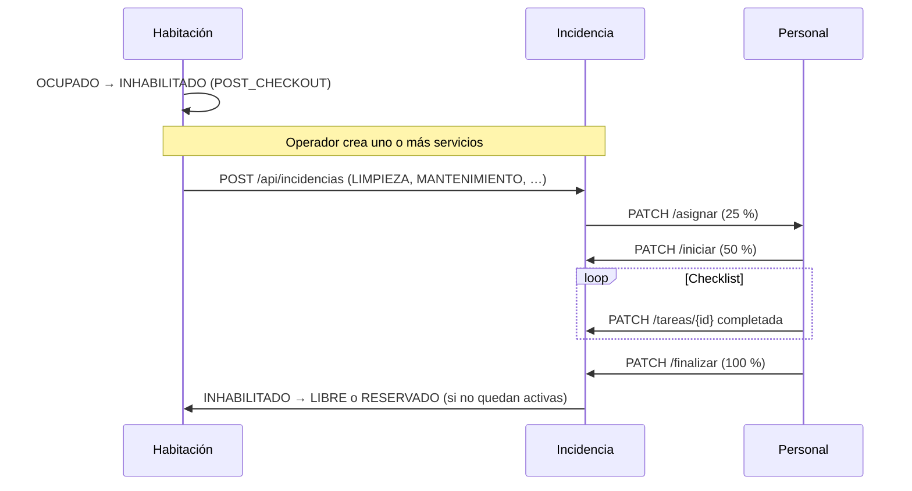

# Roomix — Backend

API REST del sistema de administración hotelera. Módulos: **habitaciones**, **incidencias**, **personal** e **inventario**.

## Requisitos

- Java 21
- Maven 3.9+
- PostgreSQL 14+

## Base de datos (PostgreSQL)

### 1. Crear la base de datos

```powershell
psql -U postgres -f src/main/resources/db/init-database.sql
```

### 2. Crear tablas y datos iniciales

```powershell
psql -U postgres -d roomix -f src/main/resources/db/schema.sql
```

El script `schema.sql` crea las tablas base: `habitaciones`, `habitacion_caracteristicas`, `inventario_categorias`, `inventario_articulos` y categorías precargadas.

Las tablas **`personal`**, **`incidencias`** e **`incidencia_tareas`** las crea Hibernate con `ddl-auto=update` al arrancar (o puedes añadirlas manualmente al esquema). Al primer arranque se inserta personal de ejemplo y categorías de inventario si faltan.

### 3. Conexión del backend

Copia `application-local.properties.example` → `application-local.properties` (ya incluido localmente con usuario `postgres`).

```properties
spring.datasource.url=jdbc:postgresql://localhost:5432/roomix
spring.datasource.username=postgres
spring.datasource.password=1234
```

Con `ddl-auto=update` Hibernate puede afinar el esquema; si ejecutaste `schema.sql` completo, también puedes usar `validate`.

## Arquitectura (capas)

```
com.example.roomix
├── RoomixApplication.java
├── config/              # CORS, OpenAPI
├── common/exception/    # Manejo global de errores
├── habitacion/          # Estados operativos de habitaciones
├── incidencia/          # Incidencias vinculadas a habitaciones (IncidenciaErrorCode)
├── personal/            # Personal asignable a incidencias
└── inventario/          # Artículos y categorías (InventarioErrorCode)
```

## Ejecutar

```bash
./mvnw spring-boot:run
```

La API queda en `http://localhost:8080`.

## Documentación Swagger / OpenAPI

| Recurso | URL |
|---------|-----|
| **Swagger UI** (interactivo) | http://localhost:8080/swagger-ui.html |
| **OpenAPI JSON** | http://localhost:8080/api-docs |

La documentación incluye descripciones, ejemplos, códigos de respuesta y esquemas de los DTOs y enums.

## Endpoints — Habitaciones

| Método | Ruta | Descripción |
|--------|------|-------------|
| GET | `/api/habitaciones` | Listar todas (filtro opcional: `?estado=LIBRE`) |
| GET | `/api/habitaciones/{id}` | Obtener por ID |
| POST | `/api/habitaciones` | Crear |
| PUT | `/api/habitaciones/{id}` | Actualizar completa |
| PATCH | `/api/habitaciones/{id}/estado` | Cambiar solo el estado |
| DELETE | `/api/habitaciones/{id}` | Eliminar |

### Ejemplo — crear habitación

```http
POST /api/habitaciones
Content-Type: application/json

{
  "numero": "101",
  "caracteristicas": ["WiFi", "TV", "Aire acondicionado", "Minibar"],
  "tipoHabitacion": "DOBLE",
  "descripcion": "Habitación doble con vista al jardín",
  "estado": "RESERVADO",
  "fechaHoraReservacion": "2026-05-25T14:30:00"
}
```

Respuesta (campos de auditoría):

```json
{
  "id": 1,
  "numero": "101",
  "estado": "RESERVADO",
  "fechaHoraReservacion": "2026-05-25T14:30:00",
  "fechaHoraUltimaActualizacion": "2026-05-23T15:10:00"
}
```

- `fechaHoraReservacion`: se asigna al pasar a `RESERVADO`. Se mantiene durante `OCUPADO` y mientras la habitación esté `INHABILITADO` por adecuación programada con reserva vigente. Se limpia al pasar a `LIBRE`.
- `motivoInhabilitacion`: obligatorio cuando el estado es `INHABILITADO` (`POST_CHECKOUT` o `ADECUACION_PROGRAMADA`).
- `fechaHoraUltimaActualizacion`: se actualiza sola en cada creación o modificación.

### Estados (`EstadoHabitacion`)

| Estado | Uso típico |
|--------|------------|
| `LIBRE` | Disponible para reservar / asignar |
| `RESERVADO` | Reserva confirmada; huésped sin check-in |
| `OCUPADO` | Huésped en la habitación; reserva en curso |
| `INHABILITADO` | Fuera de servicio; gestionar servicios (incidencias) antes de habilitar |

### Motivo de inhabilitación (`MotivoInhabilitacion`)

Obligatorio al pasar a `INHABILITADO`:

| Motivo | Origen | Destino al habilitar (sin incidencias activas) |
|--------|--------|------------------------------------------------|
| `POST_CHECKOUT` | `OCUPADO` → check-out del huésped | `LIBRE` |
| `ADECUACION_PROGRAMADA` | `LIBRE` o `RESERVADO` → preparación / adecuación | `RESERVADO` si hay reserva vigente, si no `LIBRE` |

### Flujo de estados (habitación)



Las transiciones fuera de este diagrama devuelven **422 Unprocessable Entity**.

En `INHABILITADO` se crean **manualmente** incidencias (limpieza, mantenimiento, servicio al cuarto, otro) con `POST /api/incidencias`. La habitación se **habilita sola** cuando no quedan incidencias activas (al finalizar o cancelar la última):

- `PATCH /api/incidencias/{id}/finalizar` (checklist completo).
- `PATCH /api/incidencias/{id}/cancelar`.

### Tipos (`TipoHabitacion`)

`INDIVIDUAL`, `DOBLE`, `TRIPLE`, `SUITE`, `FAMILIAR`, `EJECUTIVA`

---

## Endpoints — Personal

| Método | Ruta | Descripción |
|--------|------|-------------|
| GET | `/api/personal` | Listar personal (`?activo=true`) |

Al primer arranque se insertan tres registros de ejemplo (housekeeping) si la tabla está vacía.

---

## Endpoints — Incidencias

| Método | Ruta | Descripción |
|--------|------|-------------|
| GET | `/api/incidencias` | Listar (`?estado=`, `?habitacionId=`, `?personalId=`, `?activas=true`) |
| POST | `/api/incidencias` | Crear servicio en habitación `INHABILITADO` |
| GET | `/api/incidencias/{id}` | Detalle con tareas (checklist) |
| GET | `/api/incidencias/habitacion/{habitacionId}/activas` | Incidencias activas de una habitación |
| PATCH | `/api/incidencias/{id}/asignar` | Asignar personal → estado `ASIGNADA` (25 %) |
| PATCH | `/api/incidencias/{id}/iniciar` | Iniciar servicio en habitación → `EN_PROGRESO` (50 %) |
| PATCH | `/api/incidencias/{id}/tareas/{tareaId}` | Marcar/desmarcar check del checklist |
| PATCH | `/api/incidencias/{id}/finalizar` | Finalizar incidencia (100 %) y actualizar habitación |
| PATCH | `/api/incidencias/{id}/cancelar` | Cancelar incidencia |

### Tipos (`TipoIncidencia`)

`LIMPIEZA`, `MANTENIMIENTO`, `SERVICIO_CUARTO`, `OTRO` — se crean manualmente en habitaciones `INHABILITADO`.

### Estados (`EstadoIncidencia`)

| Estado | Progreso típico | Descripción |
|--------|-----------------|-------------|
| `CREADA` | 0 % | Incidencia generada; sin personal asignado |
| `ASIGNADA` | 25 % | Personal asignado |
| `EN_PROGRESO` | 50–99 % | Servicio iniciado; avance según checklist |
| `FINALIZADA` | 100 % | Servicio completado; puede habilitar la habitación si no quedan activas |
| `CANCELADA` | — | Incidencia cancelada; puede habilitar la habitación si no quedan activas |

### Flujo de servicios (incidencia + habitación)



### Ejemplo — crear servicio

```json
POST /api/incidencias
{
  "habitacionId": 1,
  "tipo": "LIMPIEZA",
  "descripcion": "Limpieza profunda post check-out"
}
```

### Ejemplo — asignar personal

```json
PATCH /api/incidencias/1/asignar
{
  "personalId": 1
}
```

### Ejemplo — marcar tarea completada

```json
PATCH /api/incidencias/1/tareas/3
{
  "completada": true
}
```

### Errores controlados (`IncidenciaErrorCode`)

| Código | HTTP | Descripción |
|--------|------|-------------|
| `INC-001` | 404 | Incidencia no encontrada |
| `INC-002` | 404 | Tarea no encontrada |
| `INC-003` | 404 | Habitación no encontrada |
| `INC-004` | 404 | Personal no encontrado |
| `INC-005` | 422 | Personal inactivo |
| `INC-006` | 422 | Operación no permitida en el estado actual |
| `INC-007` | 422 | Sin personal asignado |
| `INC-008` | 422 | Tareas incompletas al finalizar |
| `INC-009` | 409 | Ya existe incidencia activa para la habitación |

---

## Endpoints — Inventario

### Categorías (`/api/inventario/categorias`)

| Método | Ruta | Descripción |
|--------|------|-------------|
| GET | `/api/inventario/categorias` | Listar (`?soloActivas=true`) |
| GET | `/api/inventario/categorias/{id}` | Detalle |
| POST | `/api/inventario/categorias` | Crear categoría personalizada |
| PUT | `/api/inventario/categorias/{id}` | Actualizar |
| DELETE | `/api/inventario/categorias/{id}` | Eliminar (solo personalizadas, sin artículos) |

**Categorías precargadas** (al primer arranque): Limpieza, Mobiliario, Comida, Ropa blanca, Tecnología, Amenidades, Mantenimiento. Puedes agregar más con POST.

| Categoría | Qué incluye (ejemplos) |
|-----------|-------------------------|
| **Limpieza** | Artículos de aseo, trapeadores, paños, escobas, desinfectante |
| **Mobiliario** | Lo de una habitación: camas, mesas, lámparas, sillas, armarios |
| **Comida** | Restaurante/cocina del hotel: ingredientes, bebidas, utensilios |
| **Ropa blanca** | Toallas, sábanas, fundas |
| **Tecnología** | Routers, cables, controles |
| **Amenidades** | Jabón, shampoo, kit huésped |
| **Mantenimiento** | Herramientas y repuestos |

### Artículos (`/api/inventario`)

| Método | Ruta | Descripción |
|--------|------|-------------|
| GET | `/api/inventario` | Listar (`?categoriaId=`, `?activo=`, `?stockBajo=true`) |
| GET | `/api/inventario/{id}` | Obtener por ID |
| POST | `/api/inventario` | Crear artículo |
| PUT | `/api/inventario/{id}` | Actualizar artículo |
| PATCH | `/api/inventario/{id}/stock` | Entrada o salida de stock |
| DELETE | `/api/inventario/{id}` | Baja lógica |

Cada artículo y categoría incluye `fechaHoraCreacion` y `fechaHoraUltimaActualizacion`.

### Ejemplo — crear artículo

```json
POST /api/inventario
{
  "nombre": "Trapeador",
  "descripcion": "Trapeador con cubo incluido",
  "categoriaId": 1,
  "cantidad": 15,
  "cantidadMinima": 5,
  "unidadMedida": "UNIDAD",
  "ubicacion": "Almacén limpieza"
}
```

### Ejemplo — nueva categoría

```json
POST /api/inventario/categorias
{
  "nombre": "Spa",
  "descripcion": "Área de spa y bienestar",
  "ejemplosArticulos": "Toallas spa, aceites esenciales, batas, velas"
}
```

### Ejemplo — salida de stock

```json
PATCH /api/inventario/1/stock
{
  "tipo": "SALIDA",
  "cantidad": 5,
  "motivo": "Reposición habitación 101"
}
```

### Errores controlados (`InventarioErrorCode`)

| Código | HTTP | Descripción |
|--------|------|-------------|
| `INV-001` | 404 | Artículo no encontrado |
| `INV-002` | 409 | Nombre de artículo duplicado |
| `INV-003` | 422 | Artículo inactivo |
| `INV-004` | 422 | Stock insuficiente |
| `INV-005` | 400 | Cantidad mínima inválida |
| `INV-006` | 404 | Categoría no encontrada |
| `INV-007` | 409 | Nombre de categoría duplicado |
| `INV-008` | 422 | Categoría inactiva |
| `INV-009` | 409 | Categoría con artículos (no se puede eliminar) |
| `INV-010` | 422 | Categoría predefinida (no se puede eliminar) |

Respuesta de error (ejemplo):

```json
{
  "type": "about:blank",
  "title": "STOCK_INSUFICIENTE",
  "status": 422,
  "detail": "Stock insuficiente para 'Toalla de baño'. Disponible: 3, solicitado: 5",
  "codigo": "INV-004",
  "modulo": "INVENTARIO"
}
```
